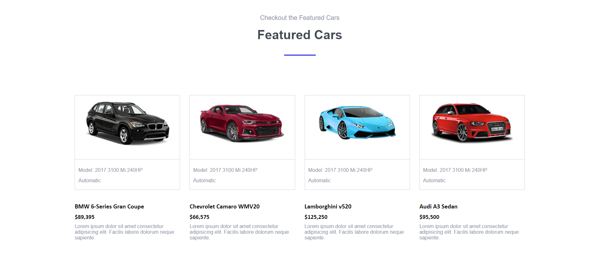
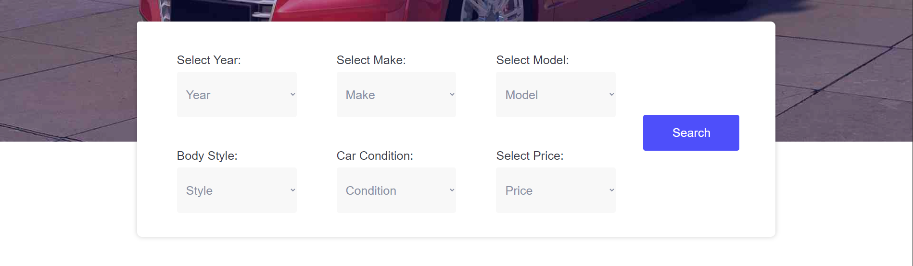
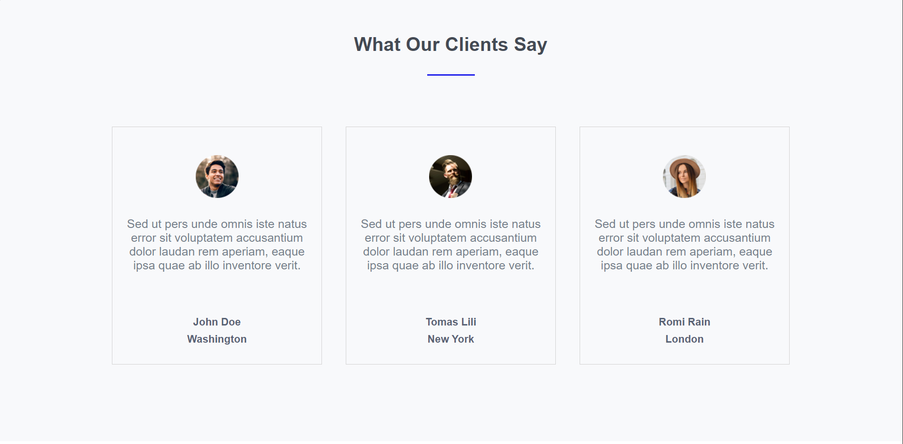

# Carvilla Website 🚗  

Welcome to the **Carvilla** project! This is a simple and visually appealing HTML and CSS website for a car dealership. It was designed to showcase car models, brands, and services while providing an engaging user experience.  

## Features  
- **Static Design:** Fully built with HTML and CSS.  
- **Car Showcases:** Highlights the latest, featured, and popular cars.  
- **Navigation Menu:** Links to sections like services, featured cars, and brands.  
- **Dropdown Filters:** Allows users to filter cars by year, make, model, body style, and condition.  
- **Client Testimonials:** Displays what clients say about the dealership.  
- **Newsletter Section:** Subscribe to stay updated.  
- **Footer:** Organized footer with contact info, links, and social media icons.  

## Limitations  
- **Not Responsive:** The website isn't optimized for mobile or tablet devices yet. Best viewed on desktop.  
- **Static Content:** Some sections include placeholder content (`Lorem ipsum`).

## Demo  
You can open `index.html` in your favorite browser to view the site.  

## Screenshots  

## Future Plans  
- Make the website **responsive** for better usability on all devices.  
- Add interactivity using **JavaScript** (e.g., functional search filters).  
- Integrate backend for a dynamic experience.  

## Contributions  
Feel free to clone the repository and suggest improvements!
